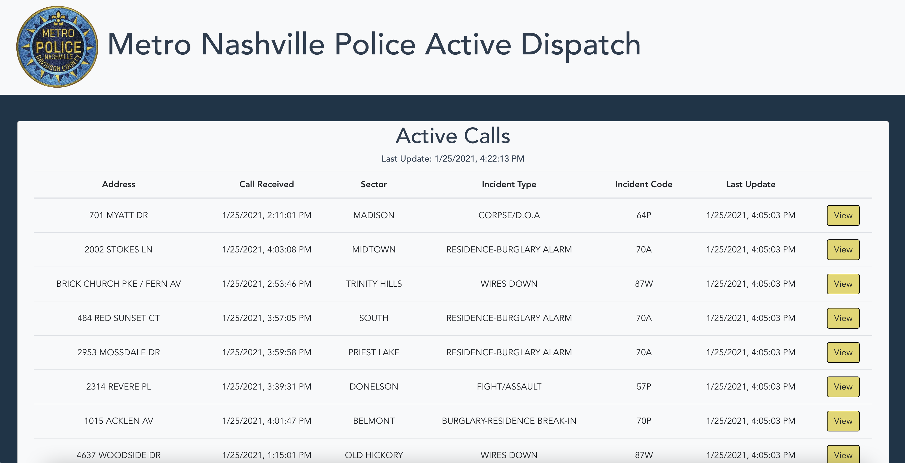
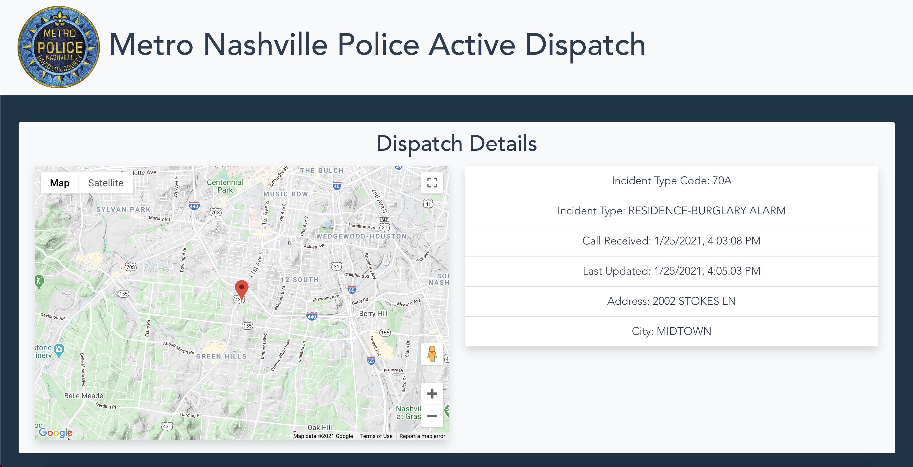

# Metro Nashville Police Scanner

## Description
This application uses the Metro Nashville Police Department Active Dispatch dataset available on [Nashville's Open Data Portal](https://data.nashville.gov/Police/Metro-Nashville-Police-Department-Active-Dispatch/qywv-8sc2) to tabulate all current active major incident calls for service received by the Emergency Communications Center dispatched to Metro Nashville Police Department.  By selecting the view button on a particular table row, the user will then be able to see the location of the incident on a map, made possible with Google's Geocoding API and Google Maps JavaScript API.

## Screenshots

## How To Run
1. Clone this repository into a local directory of your choosing.
2. Navigate into the new local repository from your command line.
3. In your command line, run `npm install`.
4. When the installation has finished, run `npm run serve` in your command line to start the development server.
5. In your browser, navigate to `http://localhost:8080/`, in order to see the current development build.